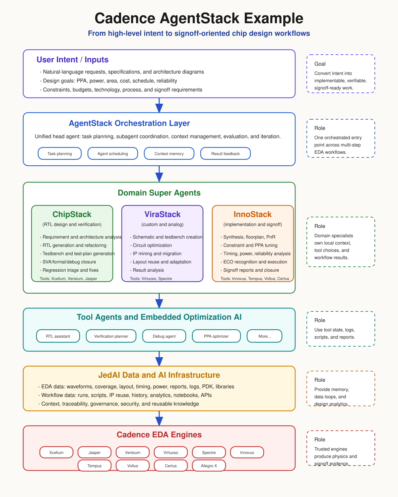

# AI Agents In Chip Design And EDA

AI agents in chip design should be treated as orchestration and reasoning layers around EDA tools, not as replacements for tool signoff. In SilicaFlow, an agent may read specifications, plan tasks, generate scripts, run tools, triage reports, propose fixes, and prepare gate summaries. The authoritative evidence remains the design database, constraints, tool logs, reports, signoff decks, and human gate approvals.

## Where This Fits

AI-agent capability belongs in the EDA/tooling layer because useful chip-design agents need controlled access to:

- design intent, architecture documents, and constraints
- RTL, schematics, layout, package, and test artifacts
- simulator, formal, synthesis, STA, PnR, power, and signoff tools
- report databases, historical runs, and design knowledge
- explicit human approval gates

The agent layer should coordinate across those artifacts. It should not silently redefine specs, constraints, waivers, timing exceptions, DRC waivers, or production test limits.

## Agent Stack Pattern

A practical EDA agent stack usually has these layers:

| Layer | Role | SilicaFlow expectation |
| --- | --- | --- |
| User intent | Product, architecture, debug, or closure objective | Capture scope, inputs, expected outputs, and validation command. |
| Orchestrator agent | Decomposes work, assigns subagents, tracks context, evaluates results | Owns task planning and status, not signoff authority. |
| Domain agents | Front-end, verification, custom, implementation, package, or test specialists | Use domain runbooks and return structured findings. |
| Tool agents | Interfaces to EDA tools, GUIs, shells, logs, reports, and scripts | Execute bounded commands and preserve tool evidence. |
| Data and memory | Design knowledge, prior runs, reports, IP metadata, and workflow state | Provide traceability and reduce repeated context gathering. |
| EDA engines | Simulation, formal, implementation, signoff, custom IC, package, and test tools | Remain the source of truth for computed results. |

## Cadence Example

The following diagram is a simplified repo-native rendering based on the user-provided Cadence agent-stack image and public Cadence descriptions of AgentStack, ChipStack, ViraStack, InnoStack, JedAI, tool agents, and Cadence EDA engines.

Cadence publicly describes this direction as a hierarchy of AI Super Agents:

- `AgentStack`: a unified head agent that orchestrates domain Super Agents and provides common interaction, knowledge, and skill sharing.
- `ChipStack`: front-end digital RTL design, verification, testbench generation, regression management, debug, and fixes.
- `ViraStack`: custom and analog design automation, including schematic creation, testbench development, circuit optimization, and layout migration.
- `InnoStack`: digital implementation and signoff from synthesis and PnR through signoff analysis and ECO execution.
- `JedAI`: a data and AI platform that captures design and workflow data for analytics and learning.
- Tool agents and optimization AI: natural-language and embedded optimization interfaces inside EDA tools.

## SilicaFlow Usage

SilicaFlow should use AI agents in four controlled ways:

1. Requirements and architecture conversion: extract requirements, budgets, interfaces, and acceptance criteria from product and architecture inputs.
2. Design and verification acceleration: generate RTL, assertions, testbenches, coverage plans, and debug summaries, then validate with the configured tool flow.
3. Closure and signoff triage: cluster timing, power, DRC, LVS, CDC, formal, and regression failures by likely root cause.
4. Productization feedback: connect wafer sort, binning, characterization, reliability, and field data back to design and process decisions.

## Guardrails

SilicaFlow agents must follow these rules:

- Do not replace signoff tools with LLM judgment.
- Do not create or modify timing exceptions without explicit review.
- Do not waive DRC, LVS, CDC, formal, ATPG, STA, package, or test failures without human approval.
- Do not treat generated scripts as correct until they are run or checked against tool documentation.
- Preserve exact report paths, tool versions, run IDs, and assumptions in summaries.
- Keep human gates authoritative for spec freeze, RTL freeze, custom freeze, synth handoff, tapeout, package release, and test signoff.

## Recommended Repo Artifacts

Useful additions for an AI-agent-enabled EDA flow:

- `orchestrator/skills/`: domain skills and runbooks
- `orchestrator/decision_trees/`: triage logic for common failures
- `schemas/`: structured report and agent-output schemas
- `reports/<stage>/report.json`: machine-readable tool evidence
- `docs/gates/`: human approval checklists
- `docs/eda-ai-agents.md`: this design note

## References

- [Cadence: Reimagining Chip Design from Spec to Signoff with Cadence AI Super Agents](https://community.cadence.com/cadence_blogs_8/b/artificial-intelligence/posts/reimagining-chip-design-from-spec-to-signoff-with-cadence-ai-super-agents)
- [Cadence: ChipStack AI Super Agent press release](https://www.cadence.com/zh_CN/home/company/newsroom/press-releases/pr/2026/cadence-unleashes-chipstack-ai-super-agent-pioneering-a-new.html)
- [Cadence: Agentic AI for Chip Design](https://www.cadence.com/ja_JP/home/ai/ai-for-design.html)
- [Cadence: JedAI Solution](https://www.cadence.com/en_US/home/solutions/cadence-jedai-solution.html)

